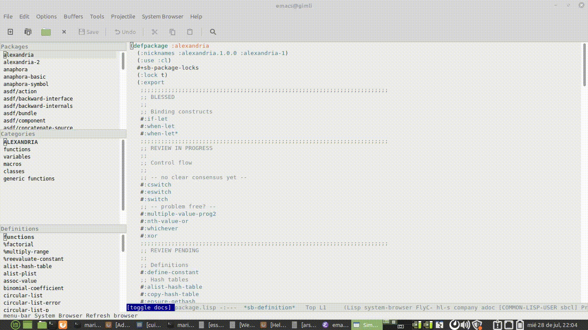

# SLY-SYSTEM-BROWSER

This is Smalltalk-like browser for Common Lisp!

[Originally written by mmonotone for SLIME](https://github.com/mmontone/lisp-system-browser), ported to Sly for all the REPL cat enjoyers out there.

NOTE THAT THIS IS VERY MUCH WORK IN PROGRESS AT THIS MOMENT. DOUBLY SO WITH THE PORT



## Install

Currently looking into getting it on MELPA. For now, though:

Install Emacs dependencies:

This depends on [emacs-window-layout](https://github.com/kiwanami/emacs-window-layout) Emacs library. Appears as `window-layout` in `M-x package-list-packages` (melpa).

Clone the repository via `git clone`. 

Add it to the Emacs `load-path` (e.g. via `(push "/path/to/sly-system-browser/" load-path)`.

Add `sly-system-browser` to `sly-contribs`.

## Use

`M-x sly-system-browser` to open the browser.

### Commands

```
sly-system-browser	      M-x ... RET
   Open the Common Lisp system browser.
quit-system-browser	      M-x ... RET
   Quit the system browser.
system-browser		      M-x ... RET
   Open the currently instantiated system browser.
system-browser-refresh	      M-x ... RET
   Refresh the system browser contents and reset its layout.
system-browser-reset-layout   M-x ... RET
   Reset system browser layout. Use this when Emacs windows break the
   browser's layout.
system-browser-toggle-docs    M-x ... RET
   Toggle documentation panel in system browser.
system-browser-browse-package M-x ... RET
   Browse a particular package completed from command bar.
```
